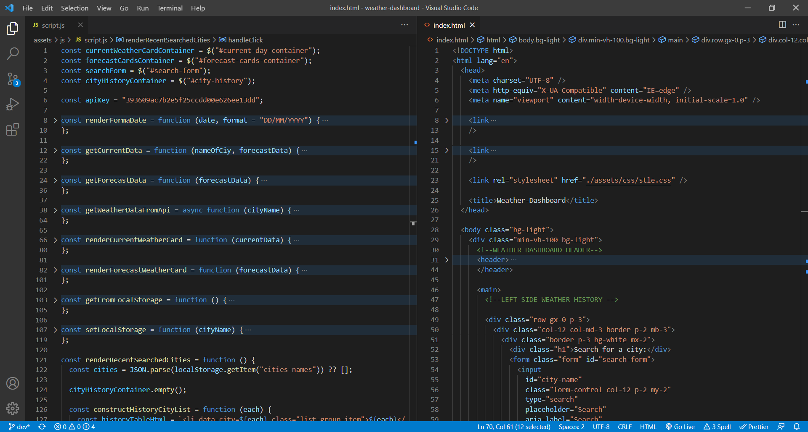
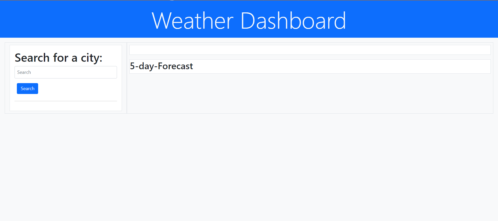
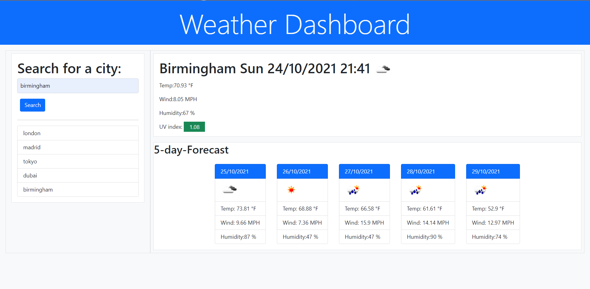

# weather-dashboard

## Description:

Created a weather dashboard application dynamically using HTML , CSS Javascript and Jquery. This app runs on a live time and informs the user of the current weather condition and the forecast of the next 5 days.

## Completed :

To see the full URL deployed web-application project <a href=https://dmo17.github.io/coding-quiz-challenge//>click here </a>

## Preview: Image Of HTML , CSS and JavaScript Code:

## Preview Image Of Web-page:

## Acceptance Criteria:

- GIVEN a weather dashboard with form inputs
- WHEN I search for a city
- THEN I am presented with current and future conditions for that city and that city is added to the search history
- WHEN I view current weather conditions for that city
- THEN I am presented with the city name, the date, an icon representation of weather conditions, the temperature, the humidity, the wind speed, and the UV index
- WHEN I view the UV index
- THEN I am presented with a color that indicates whether the conditions are favorable, moderate, or severe
- WHEN I view future weather conditions for that city
  -THEN I am presented with a 5-day forecast that displays the date, an icon representation of weather conditions, the temperature, the wind speed, and the humidity
- WHEN I click on a city in the search history
- THEN I am again presented with current and future conditions for that city
